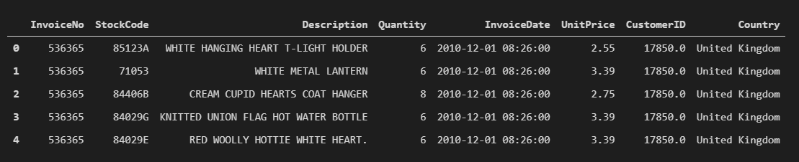
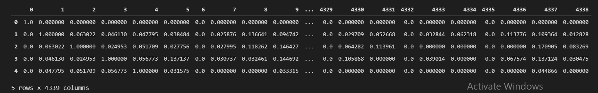

## Product-Recommendation-System
---
Here we are going to produce a list of recommendations:based on collaborative filtering method.

---
+ *Collaborative Filtering* - It is a method based on previous user behaviours such as pages they viewed, products they purchased or ratings they have given to different items. The assumption here is that a user is likely to purchase or view similar type of contents that they have viewed or purchased in the past.

In this process we first develop a user to item matrix where individual users are represented in rows and individual items in columns, and then compute the similarities between users by using the cosine similarity equation.

---

## Problem Statement

To build a product recommender system with the goal of predicting a list of items that a customer is likely to purchase.

---

## Data

---
InvoiceNo : Unique identifier for transaction

StockCode : Unique identifier for the stock item being purchased

Description : Description of item

Quantity : Number of units purchased

InvoiceDate : Date of purchase

UnitPrice : Cost of one unit of the item

CustomerID : Unique Identifier for customer

Country : Country of transaction

---

+ Data Processing
   
   * Removing Product returns
   
   * Identifying Null rows

   * Handling Nan CustomerIDs

   * Creating customer-item matrix

+ Collaborative Filtering

   * User-based

   * Item-based
---

*Removing Product Returns* : The negative values in quantity column are products that were returned after purchase and hence will not be considered as purchase.

*Identifying and Handling NaN* : Without correct or missing values in dataset we will not be able to build a proper recommendation system.

*Creating Customer_Item Matrix* : Tabular data where each column represents each product or item and each row represents a customer and the value in each cell represents whether the customer purchased the given product or not.

---

+ User-Based Filtering

We compute the cosine similarity from the customer item matrix to determine similarity between user's purchase behaviour.

Customers having high similarity with CustomerId 12350 is given as

For reference we take Customer 12350 as A and Customer 17935 as B. So Identifying the items purchased by Customer A and Customer B and the remainder of Items of Customer A over Customer B, we can safely assume that since there is high similarity between the customers the remainder of the products purchased by customer A is also likely to be purchased by customer B. Hence we make the recommendation of those remaining products to Customer B.

+ Item Based Filtering

---

## Conclusion

Using user-based collaborative filtering we can can do targeted product recommendations for individual customers. We can also custom-tailor and also include these products that each target customer is likely to purchase in marketing messages which can potentially drive more conversions from customers. However it is limited to only existing customers, however item-based colloborative filtering method overcomes this drawback and can be applied to both new and existing customers to drive higher conversion from customers.